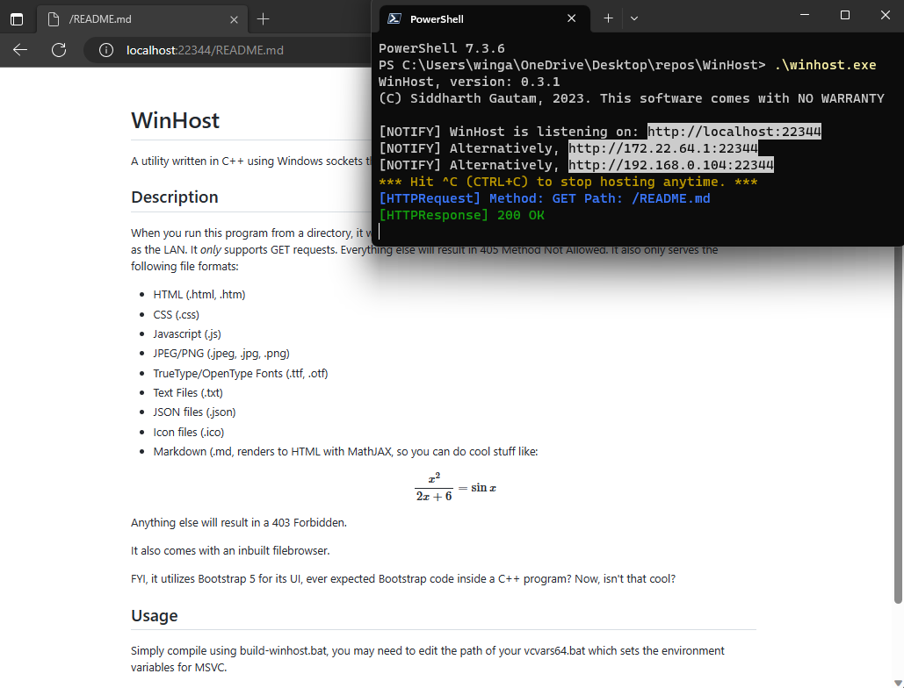
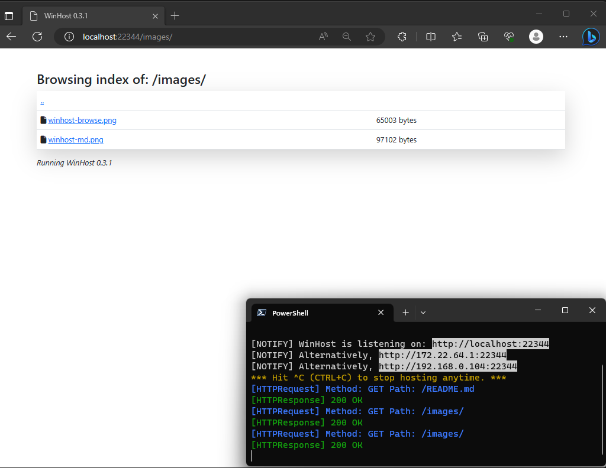
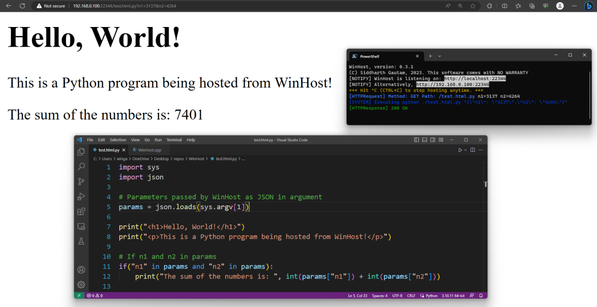

# WinHost

A utility written in C++ using Windows sockets that acts as a simple HTTP GET server along with some nifty features.

## Description

When you run this program from a directory, it will begin serving web pages on your localhost:22344 (0x5748 = 'WH') as well as the LAN. It *only* supports GET requests. Everything else will result in 405 Method Not Allowed. It also only serves the following file formats:

- HTML (.html, .htm)
- CSS (.css)
- Javascript (.js)
- JPEG/PNG (.jpeg, .jpg, .png)
- TrueType/OpenType Fonts (.ttf, .otf)
- Text Files (.txt)
- JSON files (.json)
- Icon files (.ico)
- Markdown (.md), renders to HTML with MathJAX, so you can do cool stuff like: 
    $$ \frac{x^2}{2x + 6} = \sin{x} $$
- Python Code (.html.py), renders the stdout as html, see test.py.html for an example.

Anything else will result in a 403 Forbidden.

It also comes with an inbuilt filebrowser.

FYI, it utilizes Bootstrap 5 for its UI, ever expected Bootstrap code inside a C++ program? Now, isn't that cool?

## Usage

Simply compile using build-winhost.bat, you may need to edit the path of your vcvars64.bat which sets the environment variables for MSVC.

The default port is 22344 which is ASCII-16 for WinHost's initials i.e. 'WH' 😄, if you wish to change this, ehm... I tried to add port as a dynamic argument but Windows defender flags it as a Trojan. So, yeah, if you want a unique port just change the port value in main() to something else. 

## Screenshots

<table>
<thead>
<th>WinHost rendering its own README</th>
<th>File Browser</th>
<th>Python Application</th>
</thead>
<tr>
<td></td>
<td></td>
<td></td>
</tr>
</table>